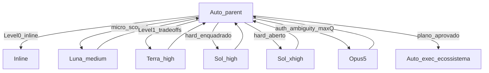

# Model Routing — cursor-md

Policy source of truth: always-on rule [`ecosystem/rules/model-routing.mdc`](../ecosystem/rules/model-routing.mdc), mirrored in [`AGENTS.md`](../AGENTS.md) and `subagent-orchestration`. LEARNINGS does **not** host this constitution.

## Principle

Parent stays on **Auto**. Premium models run as `Task` subagents with `model:` only when an exclusive-lane trigger matches. Plan mode does not always escalate to Sol/Opus.

## Slugs and effort

| Lane | Slug | Effort |
|------|------|--------|
| Micro | `gpt-5.6-luna-medium` | Medium |
| Medium | `gpt-5.6-terra-high` | High |
| Hard framed | `gpt-5.6-sol-high` | High |
| Hard open | `gpt-5.6-sol-xhigh` | Extra High |
| Critical | `claude-opus-5-thinking-high` | Thinking High |

**Forbidden:** `gpt-5.6-terra-medium`, `gpt-5.6-sol-medium`. Never silently downgrade. Composer / Grok / Fable / Sonnet out of default roster.

## Sol bifurcation

After the Sol lane trigger is true:

1. Clear constraints + dominant hypothesis + obvious done → `gpt-5.6-sol-high`
2. Else (multi-hypothesis / open analysis / costly miss) → `gpt-5.6-sol-xhigh`

Sol High does not overlap Terra High (Terra = Level 1 / medium only).

## Anti-convergence

Pick the cheapest lane whose exclusive job covers the task. Clear constraints → Sol (not Opus). Ambiguity / security risk → Opus. Never Sol+Opus in parallel on the same question.
